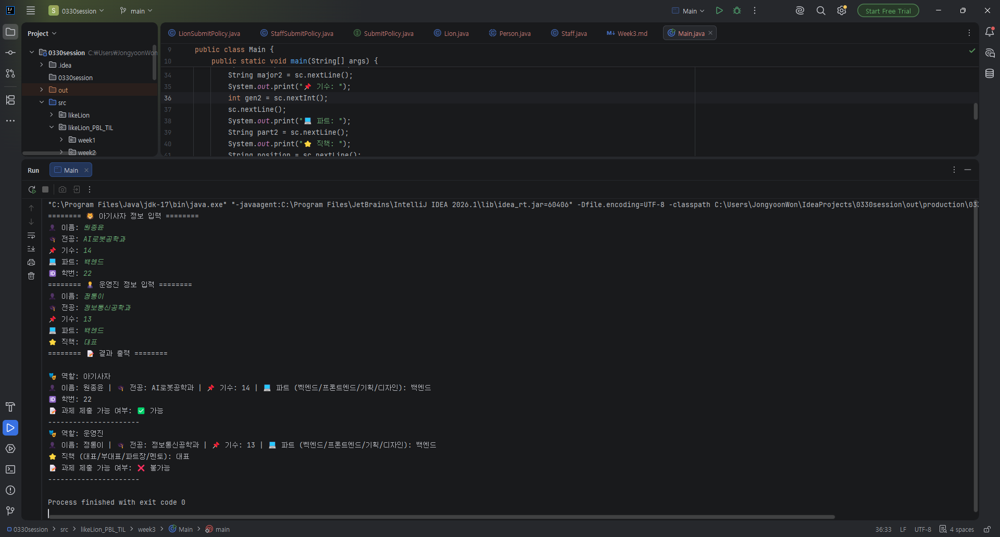

# 📘 Today I learned...

## 1. 오늘 배운 내용

### Week 3 TIL — 객체지향 II - 상속/다형성/추상화

**날짜**: 2026.04.26

**학습 주제**: 추상 클래스, 정책 인터페이스, 다형성

---

### 추상 클래스와 상속 구조
이름, 전공, 기수, 파트 같은 **공통 속성은 추상 클래스 `Person`에서 관리**하고,
`Lion`과 `Staff`는 이를 상속받아 각자의 추가 속성(학번, 직책)과 출력 방식을 구현했다.

```java
public abstract class Person {
    private String name;
    private String major;
    private int generation;
    private String part;

    protected abstract SubmitPolicy getPolicy();
    public abstract String getInfo();

    public boolean canSubmit() {
        return getPolicy().canSubmit();
    }
}
```

### 정책 인터페이스로 역할 분리
과제 제출 가능 여부를 `if/else`로 처리하는 대신, `SubmitPolicy` **인터페이스로 분리**했다.
`Lion`은 `LionSubmitPolicy`(true), `Staff`는 `StaffSubmitPolicy`(false)를 반환하도록 구현했다.

```java
public interface SubmitPolicy {
    boolean canSubmit();
}
```

```java
// Lion 클래스에서 자신에 맞는 정책 객체를 반환
@Override
protected SubmitPolicy getPolicy() {
    return new LionSubmitPolicy();
}
```

### 다형성으로 역할 판단 위임
`Main`에서 `Person` 타입 하나로 `Lion`과 `Staff`를 통합 처리한다.
`canSubmit()` 호출 한 줄로 역할별 판단이 자동으로 이뤄지고, **조건문이 필요 없다.**

```java
for (Person p : new Person[]{lion, staff}) {
    System.out.println(p.getInfo());
    System.out.println("과제 제출 가능 여부: " + (p.canSubmit() ? "✅ 가능" : "❌ 불가능"));
}
```

---

## 3. 결과 이미지(스크린샷)



---

## 4. 느낀 점

`Lion`이랑 `Staff`를 따로 구분해서 처리하는 게 아니라 `Person` 타입 하나로 묶어서 같은 메서드만 호출하면 돼서 생각보다 간단했다.

`super()`를 오랜만에 써봤는데, 부모 생성자 한 번 호출로 공통 필드를 한꺼번에 초기화할 수 있어서 이래서 상속이 편하구나 싶었다.

> # 편하구나~~