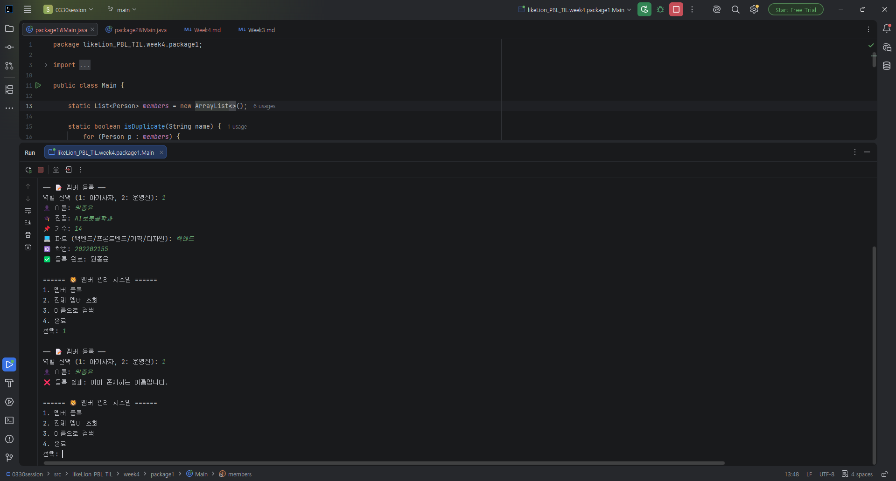
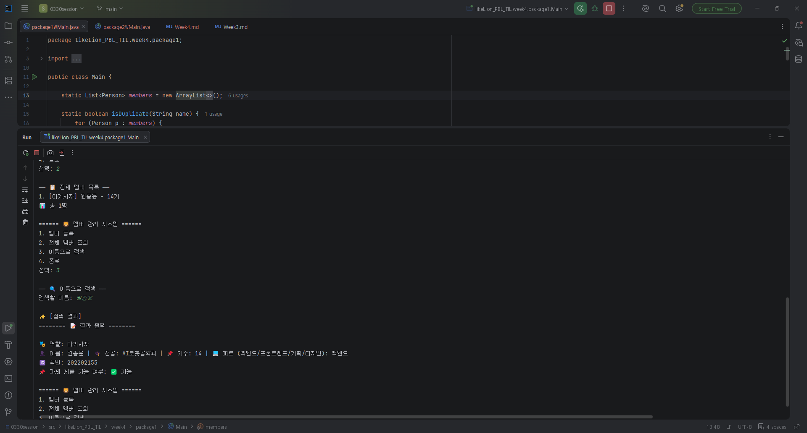
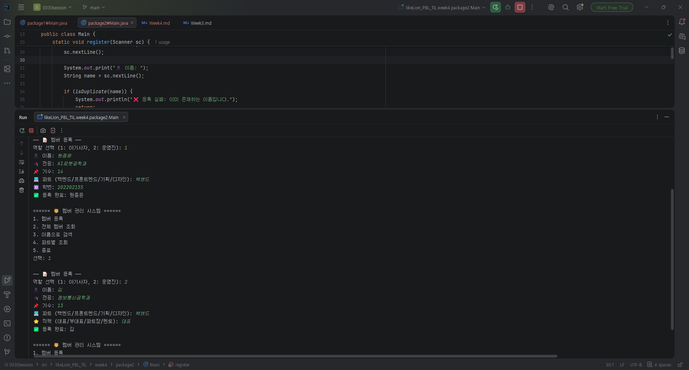
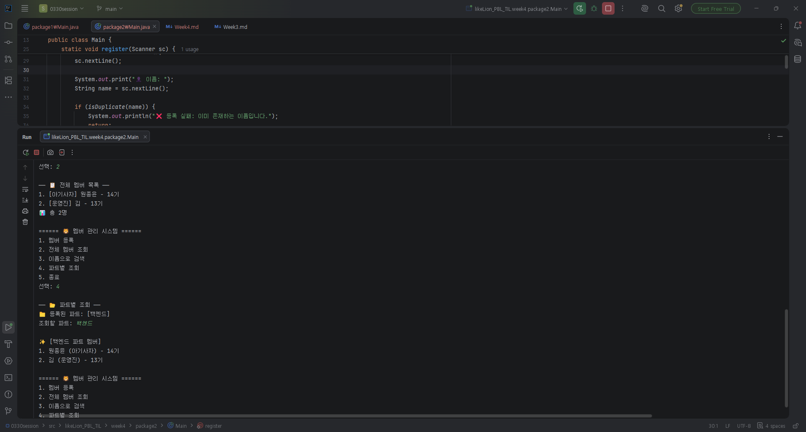
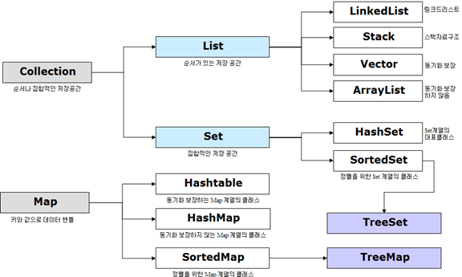

# 📘 Today I learned...

## 1. 오늘 배운 내용

### Week 4 TIL — Java Collections & 설계 확장

**날짜**: 2026.05.03

**학습 주제**: List, Map, 컬렉션 프레임워크

---

### List로 여러 객체 관리하기
기존에는 `Person` 객체 하나만 다뤘지만, 이번엔 `List<Person>`으로 여러 멤버를 동적으로 저장했다.
배열과 달리 크기를 미리 정하지 않아도 되고, `add()` 하나로 바로 추가할 수 있다.

```java
List<Person> members = new ArrayList<>();

members.add(new Lion(name, major, gen, part, studentId));
```

이름 중복 검사는 List를 순회하면서 `equals()`로 비교했다.

```java
static boolean isDuplicate(String name) {
    for (Person p : members) {
        if (p.getName().equals(name)) return true;
    }
    return false;
}
```

### Map으로 파트별 그룹화하기
Step 2에서는 `Map<String, List<Person>>`을 추가해 파트를 키, 해당 파트 멤버 목록을 값으로 관리했다.
`putIfAbsent()`를 쓰면 파트가 없을 때만 새 리스트를 생성하고, 있으면 기존 리스트에 추가한다.

```java
Map<String, List<Person>> partMap = new HashMap<>();

partMap.putIfAbsent(part, new ArrayList<>());
partMap.get(part).add(p);
```

파트별 조회는 `containsKey()`로 파트 존재 여부를 먼저 확인하고 출력했다.

```java
if (!partMap.containsKey(part)) {
    System.out.println("❌ 해당 파트 없음");
    return;
}
```

---

## 3. 결과 이미지(스크린샷)






---

## 4. 느낀 점

`List`는 배열이랑 비슷해 보이지만, 크기를 신경 쓰지 않아도 된다는 게 편했다.



코드 작성하면서 컬렉션 프레임워크가 뭐었지 하고 잠시 고민을 했었다. 
자바로 코딩테스트 연습을 안해서 다 까먹었다. 

자바로 코딩테스트 준비하면 유용하다고 졸업생 선배님께서 최근에 말씀해 주셨는데 열심히 해야겠다.